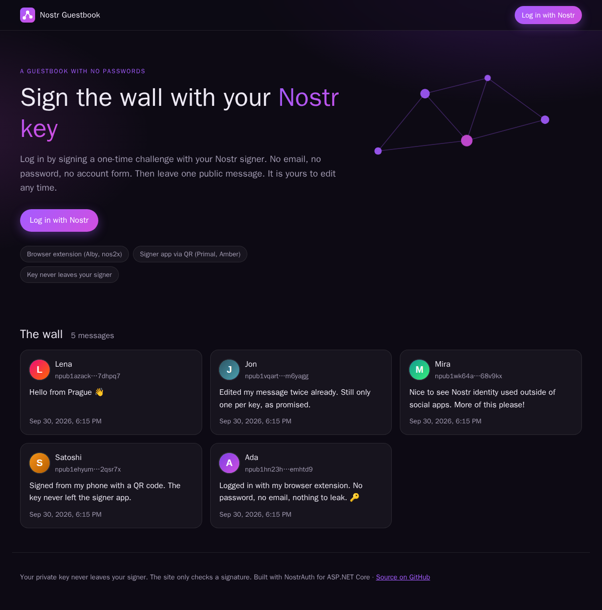
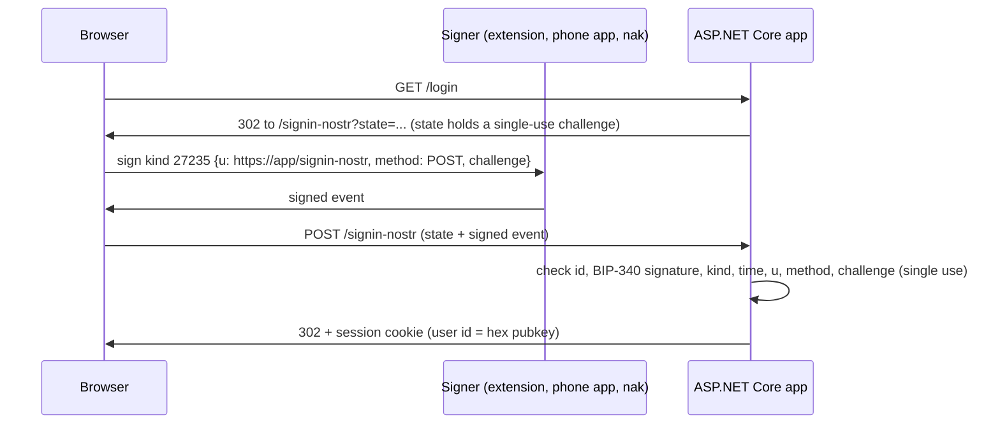
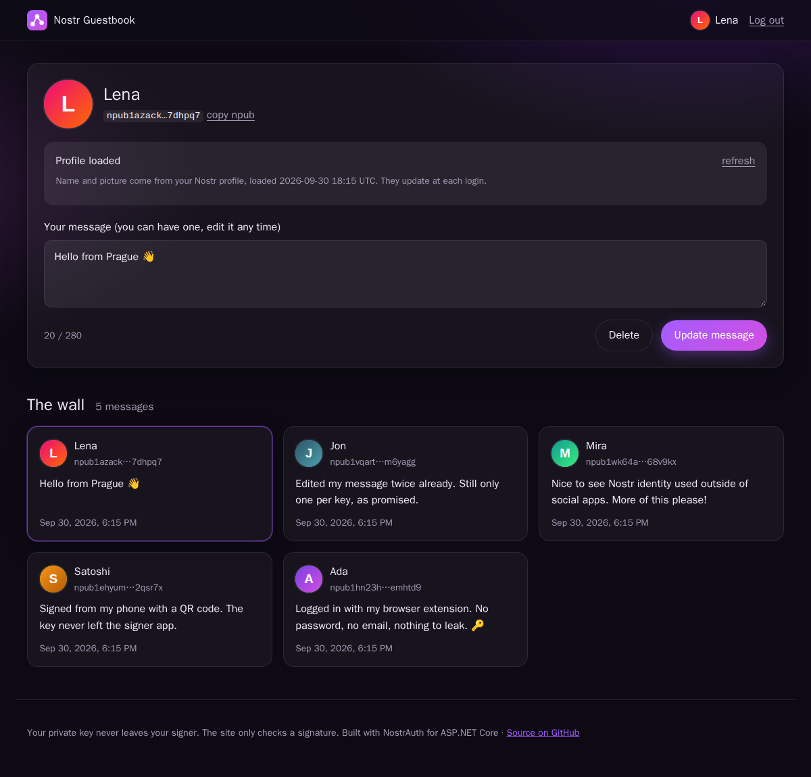

# Log in with Nostr for ASP.NET Core

Use a Nostr key as the login for any .NET web app. The app does not need to be a Nostr client.
The user proves control of their key by signing a small, single-use event. The app checks the
signature and uses the public key as the user's identity. There are no passwords, no email
addresses, and no private keys on the server.

This repository contains:

| Part | What it is |
|---|---|
| [**Nostr Guestbook**](#nostr-guestbook) | A complete example app: log in with Nostr, leave one public message. Runs with one `docker run`. |
| [`src/NostrAuth`](src/NostrAuth) | The library: `AddAuthentication().AddNostr()`, like `AddGoogle()`, plus NIP-98 for APIs. |
| [`samples/`](samples) | Five small demos: cookie login, ASP.NET Core Identity, NIP-98 API, OpenID Connect provider and client. |
| [`docs/research.md`](docs/research.md) | Research: the relevant NIPs, design decisions, signer apps (including iPhone), security notes. |



## Quick start

```bash
docker run -d -p 8080:8080 -v nostr-guestbook:/data ghcr.io/urza/nostr-login
```

Open <http://localhost:8080> and click **Log in with Nostr**.

## How the login works



The login page offers three ways to sign:

| Way | For whom | Tested with |
|---|---|---|
| Browser extension (NIP-07) | Desktop browsers with Alby, nos2x, Flamingo, Keys.band, or Nostash on iPhone Safari | nos2x |
| Signer app (NIP-46, QR code) | Primal, Amber, nsec.app, Clave and other remote signers. The server does the NIP-46 part, so the page needs no Nostr JavaScript library. | Primal (iPhone), `nak bunker` |
| Sign manually | Developers. The page shows a ready `nak event ...` command. | `nak` |

## Nostr Guestbook

A small, complete app on top of the library ([`app/NostrGuestbook`](app/NostrGuestbook)).



- **Fast login.** The user signs, and the app lets them in at once. Name and picture load in the background afterwards. A panel shows each step: which relays the app asks, what each relay answers, and the NIP-05 check.
- **One message per user.** Each Nostr key can have one public message. The user can edit or delete it at any time, also on later visits. The pubkey is the database key, so a second message is not possible.
- **Public wall.** Everyone sees all messages with names and avatars, without login. Users without a Nostr profile get a generated avatar.
- **Dark and light theme**, phone and desktop layouts.
- **Small footprint.** SQLite, one container, non-root user, images for amd64 and arm64.

### Run with Docker

```bash
docker run -d --name nostr-guestbook -p 8080:8080 -v nostr-guestbook:/data ghcr.io/urza/nostr-login
```

To see which version runs, look at the page footer (`version <commit>`, linked to the commit on GitHub), or ask the server:

```bash
curl https://guestbook.example.com/version    # full commit SHA of the running build
```

The volume `/data` holds the database and the keys that encrypt login cookies. Keep it: without it, a new container has no messages and all users must log in again.

On a real domain, run it behind a reverse proxy with HTTPS. The signed login event and the QR code must name the exact address that the user sees in the browser. The image reads `X-Forwarded-Proto` and `X-Forwarded-For` from the proxy by default, so with a proxy that passes the `Host` header (Caddy, Traefik, nginx with `proxy_set_header Host $host`) no setting is needed. Publish the port to localhost only, so nobody can send forged forwarded headers to the container:

```bash
docker run -d --name nostr-guestbook -p 127.0.0.1:8080:8080 -v nostr-guestbook:/data \
  ghcr.io/urza/nostr-login
```

If the proxy changes the host or does not send `X-Forwarded-Proto`, set the public address:

```bash
docker run -d --name nostr-guestbook -p 127.0.0.1:8080:8080 -v nostr-guestbook:/data \
  -e Nostr__PublicOrigin=https://guestbook.example.com \
  ghcr.io/urza/nostr-login
```

The login page compares the address in the browser with the address that the app knows. When they differ, it shows a notice with both addresses. That is the first thing to check when a login fails.

### Logs

The login page shows the same facts to the user: under the QR code, **Connection details** lists each relay with its state (listening, reconnecting, closed, unreachable, and whether it accepted or refused the last request), the signer and the relay it answered through, the request that waits for a reply with the number of copies sent, and the last events of the session. A tester can send a screenshot of it.

The app writes to standard output, so `docker logs -f nostr-guestbook` shows them. The library's category `NostrAuth` is at `Debug` level by default: every QR-code login is one `Nostr Connect <id>` session, and the log has a line for each relay it uses, each request it sends (with copies), each reply, each relay complaint, and the outcome. A refused login POST logs the reason, the pubkey and the `u` tag. To make the log quieter, set `Logging__LogLevel__NostrAuth=Information` or `Warning`.

### Configuration

All settings are environment variables. Lists use `__0`, `__1` and so on.

| Variable | Default | Meaning |
|---|---|---|
| `Nostr__PublicOrigin` | request scheme and host | Public address, for example `https://guestbook.example.com`. Needed behind a proxy that changes the host or does not send `X-Forwarded-Proto`. |
| `ASPNETCORE_FORWARDEDHEADERS_ENABLED` | `true` in the image, `false` with `dotnet run` | Reads `X-Forwarded-Proto` and `X-Forwarded-For`, so the app sees the public scheme and the real client IP (for rate limits). Set `false` when the container port is reachable directly, because the headers are trusted from any client. |
| `Nostr__NostrConnectRelays__0`, `__1`, ... | `relay.primal.net`, `nrs.primal.net`, `relay.nip46.com`, `bucket.coracle.social` | Relays for the QR-code login: dedicated NIP-46 relays that keep a request for a signer that subscribes late, not general-purpose relays. The QR code lists only the relays that the server could reach, in this order. |
| `Nostr__ProfileRelays__0`, `__1`, ... | `purplepag.es`, `relay.primal.net`, `relay.damus.io`, `nos.lol` | Relays for names and pictures. |
| `Guestbook__DataDirectory` | `/data` in Docker | Folder for the database and the cookie keys. |
| `ASPNETCORE_HTTP_PORTS` | `8080` | Port inside the container. |

### Build from source

```bash
dotnet run --project app/NostrGuestbook        # http://localhost:5110, data in app/NostrGuestbook/guestbook-data
docker build -t nostr-guestbook .              # the same image as the published one
```

### Publishing

[`.github/workflows/docker.yml`](.github/workflows/docker.yml) runs on each push to `main`:

1. It runs the tests.
2. It builds the image for `linux/amd64` and `linux/arm64`.
3. It pushes `ghcr.io/urza/nostr-login:latest` and `:sha-<commit>`.

A tag like `v1.2.0` also publishes `:1.2.0` and `:1.2`. Pull requests only build.

A new GitHub package is private. After the first run, open the package settings on GitHub and set the visibility to **Public**, so `docker run` works without `docker login`.

## Use the library in your app

```csharp
builder.Services.AddAuthentication(o =>
    {
        o.DefaultScheme = CookieAuthenticationDefaults.AuthenticationScheme;
        o.DefaultChallengeScheme = NostrLoginDefaults.AuthenticationScheme;
    })
    .AddCookie()
    .AddNostr(o =>
    {
        o.AppName = "My app";                          // shown on the login page and in the signer app
        o.PublicOrigin = "https://app.example.com";    // needed behind a reverse proxy
    });
```

`AddNostr()` is a normal remote authentication scheme. The login page comes with it (`/signin-nostr`). With ASP.NET Core Identity, Nostr appears as an external login with no extra code (see [Demo.IdentityLink](samples/Demo.IdentityLink)).

Claims after login:

| Claim | Value |
|---|---|
| `ClaimTypes.NameIdentifier`, `nostr:pubkey` | 64-char lowercase hex pubkey. Use this as the account key. |
| `nostr:npub` | The same key in NIP-19 form, for display. |
| `ClaimTypes.Name` | Profile name from kind 0, or a short npub. Display only. |
| `nostr:name` | Profile name from kind 0. Absent when the profile has no name. Display only. |
| `nostr:picture` | Profile picture URL (http/https only). Display only. |
| `nostr:nip05` | Present only if the NIP-05 handle resolved to this key at login time. |

Names, pictures and NIP-05 handles are display data: the user can change them at any time. Never use them as the account key.

For APIs, add NIP-98 (each request carries its own signed event):

```csharp
builder.Services.AddAuthentication().AddNostrHttpAuth();
app.MapGet("/api/me", ...).RequireAuthorization(p => p
    .AddAuthenticationSchemes(NostrHttpAuthDefaults.AuthenticationScheme).RequireAuthenticatedUser());
```

Main options of `AddNostr()`:

| Option | Default | Notes |
|---|---|---|
| `CallbackPath` | `/signin-nostr` | The login page (GET) and the login POST. |
| `PublicOrigin` | request scheme and host | Set it behind a proxy. |
| `NostrConnectRelays` | `relay.primal.net`, `nrs.primal.net`, `relay.nip46.com`, `bucket.coracle.social` | Empty list turns the QR code option off. Use your own relay if you can. |
| `MaxNostrConnectSessions` | 100 | Active NIP-46 sessions per instance. |
| `ProfileRelays` | `purplepag.es`, `relay.primal.net`, `relay.damus.io`, `nos.lol` | Empty list turns the profile lookup during login off. |
| `AllowManualEvent` | `true` | The "Sign manually" box. |
| `MaxEventAge` / `MaxFutureSkew` | 5 min / 1 min | Time window for `created_at`. |

## Demos

| Demo | Port | What it shows |
|---|---|---|
| [Demo.CookieLogin](samples/Demo.CookieLogin) | 5101 | The smallest app. No database: the pubkey is the user id in a cookie. |
| [Demo.IdentityLink](samples/Demo.IdentityLink) | 5102 | The standard `webapp --auth Individual` template plus one line. Sign up with Nostr only, or link a Nostr key to a password account. |
| [Demo.NostrApi](samples/Demo.NostrApi) | 5103 | An API with NIP-98 HTTP Auth, with a browser page and a console client. |
| [Demo.OidcProvider](samples/Demo.OidcProvider) | 5104 | "Nostr ID": an OpenID Connect provider where users log in with Nostr. |
| [Demo.OidcClient](samples/Demo.OidcClient) | 5105 | A normal app with `AddOpenIdConnect()` and no Nostr code at all. Start Demo.OidcProvider first. |

```bash
dotnet run --project samples/Demo.CookieLogin      # http://localhost:5101
```

## Tests

```bash
dotnet test tests/NostrAuth.Tests
```

- NIP-44 is checked against the [official test vectors](https://github.com/paulmillr/nip44). Event ids are checked against events from public relays and events signed by nostr-tools and nak.
- The login flow tests cover replay, phishing-style URL changes, login CSRF, old events and NIP-98 body checks.
- If [nak](https://github.com/fiatjaf/nak) is on the `PATH` (or in `~/.local/bin`), the tests also run a local relay and a NIP-46 signer, and do a full QR-code login. Without nak, these tests are skipped.

Browser tests (Playwright) run against running apps. A fake NIP-07 extension signs with a throwaway key:

```bash
cd tests/e2e
npm install
npx playwright install chromium
# Guestbook: start it with the test profile relay first (the script starts nak on port 10555)
#   Nostr__ProfileRelays__0=ws://127.0.0.1:10555 dotnet run --project app/NostrGuestbook
node guestbook.mjs
node cookie-login.mjs     # Demo 1
node identity-link.mjs    # Demo 2
node api.mjs              # Demo 3
node oidc.mjs             # Demo 4
```

## Security notes

- **The private key never reaches the server.** A stolen database holds only public keys.
- **Each login event is valid once**, for a few minutes, and only for this site's login URL.
- **Not phishing-proof.** A live phishing site can ask the user to sign a login for the real site and forward it. Passkeys block this, because the browser adds the real origin; no Nostr signer does this yet. Users must check the site name in their signer's prompt. Details: [docs/research.md, section 8](docs/research.md#8-security-notes).
- **No key recovery.** A lost Nostr key cannot be reset. Apps with valuable accounts should offer a second login method.
- **Profile lookups call out.** The server connects to public relays and to NIP-05 domains. NIP-05 requests to private and loopback addresses are blocked.

### Before production

- HTTPS everywhere.
- On more than one instance: a shared `IChallengeStore` (for example Redis), a shared Data Protection key ring, and a shared NIP-98 replay cache.
- Your own relay for NIP-46, if you can.

### Not tested yet

- Signer apps other than Primal (Amber, nsec.app, Clave) and extensions other than nos2x.
- A successful NIP-05 check against a real domain. Only the failure path is tested.
