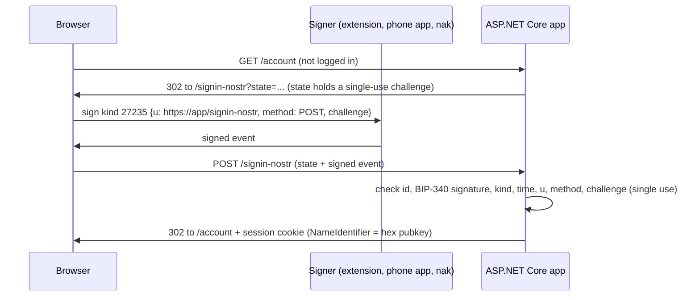

# Log in with Nostr for ASP.NET Core

Research and demo apps for Nostr as a login and identity layer in .NET web apps.

The apps are not Nostr clients. The user proves control of a Nostr key by signing a small, single-use event. The app verifies the signature and uses the public key as the user's identity. After that, the app uses normal ASP.NET Core cookies and Identity.

- Research, design decisions and findings: [docs/research.md](docs/research.md)
- Shared library: [src/NostrAuth](src/NostrAuth)
- Demos: [samples](samples)

## How the login works



The login page offers three signer channels:

| Channel | For whom |
|---|---|
| Browser extension (NIP-07) | Desktop users with Alby, nos2x, Flamingo, Keys.band or similar. |
| Signer app (NIP-46, QR code) | Users with Amber (Android), nsec.app or another remote signer. The server does the NIP-46 part, so the page needs no Nostr JavaScript library. |
| Sign manually | Developers and CLI users. The page shows a ready `nak event ...` command. |

## Demos

| Demo | Port | What it shows |
|---|---|---|
| [Demo.CookieLogin](samples/Demo.CookieLogin) | 5101 | The smallest app. No database: the pubkey is the user id in a cookie. Shows the claims, the kind-0 profile name and picture, and a verified NIP-05 handle. |
| [Demo.IdentityLink](samples/Demo.IdentityLink) | 5102 | The standard `webapp --auth Individual` template (Identity + SQLite) plus one line: `AddAuthentication().AddNostr()`. Sign up with Nostr only, or link a Nostr key to a password account under *Manage account › External logins*. |
| [Demo.NostrApi](samples/Demo.NostrApi) | 5103 | An API with NIP-98 HTTP Auth: every request carries its own signed event. Has a browser page and a console client ([Demo.NostrApi.Client](samples/Demo.NostrApi.Client)). |
| [Demo.OidcProvider](samples/Demo.OidcProvider) | 5104 | "Nostr ID": an OpenID Connect provider (OpenIddict) where users log in with Nostr. The `sub` claim is the hex pubkey. |
| [Demo.OidcClient](samples/Demo.OidcClient) | 5105 | A normal app with `AddOpenIdConnect()`. It has no Nostr code at all. Start Demo.OidcProvider first. |

### Run a demo

You need the [.NET 10 SDK](https://dotnet.microsoft.com/download).

```bash
dotnet run --project samples/Demo.CookieLogin      # http://localhost:5101
dotnet run --project samples/Demo.IdentityLink     # http://localhost:5102
dotnet run --project samples/Demo.NostrApi         # http://localhost:5103
dotnet run --project samples/Demo.NostrApi.Client  # console client for 5103
dotnet run --project samples/Demo.OidcProvider     # http://localhost:5104
dotnet run --project samples/Demo.OidcClient       # http://localhost:5105
```

If the app runs behind a proxy or port forward with another host name, set the public origin. The signed event must name the exact URL that the user sees:

```bash
Nostr__PublicOrigin=https://demo.example.com dotnet run --project samples/Demo.CookieLogin
```

Demo 1 can also use other NIP-46 relays, for example your own:

```bash
Nostr__NostrConnectRelays__0=wss://relay.example.com dotnet run --project samples/Demo.CookieLogin
```

### Log in without a browser extension

[nak](https://github.com/fiatjaf/nak) can play both signer roles:

```bash
nak key generate                                   # a throwaway secret key (hex)
# "Sign manually": copy the command from the login page, put your key in place of <your nsec>.
# "Signer app": run a bunker once, then give it the nostrconnect:// link from the login page.
nak bunker --persist --profile demo --sec <hex key> wss://nos.lol
nak bunker connect --profile demo 'nostrconnect://...'
```

## Use the library in your app

```csharp
builder.Services.AddAuthentication(o =>
    {
        o.DefaultScheme = CookieAuthenticationDefaults.AuthenticationScheme;
        o.DefaultChallengeScheme = NostrLoginDefaults.AuthenticationScheme;
    })
    .AddCookie()
    .AddNostr(o =>
    {
        o.AppName = "My app";                          // shown on the login page and in the signer app
        o.PublicOrigin = "https://app.example.com";    // needed behind a reverse proxy
    });
```

`AddNostr()` is a normal remote authentication scheme, like `AddGoogle()`. With ASP.NET Core Identity it appears as an external login with no extra code (see Demo 2 for the one page override that makes email optional).

Claims after login:

| Claim | Value |
|---|---|
| `ClaimTypes.NameIdentifier`, `nostr:pubkey` | 64-char lowercase hex pubkey. Use this as the account key. |
| `nostr:npub` | The same key in NIP-19 form, for display. |
| `ClaimTypes.Name` | Profile name from kind 0, or a short npub. Display only. |
| `nostr:name` | Profile name from kind 0. Absent when the profile has no name. Display only. |
| `nostr:picture` | Profile picture URL (http/https only). Display only. |
| `nostr:nip05` | Present only if the NIP-05 handle resolved to this key at login time. |

For APIs, add NIP-98:

```csharp
builder.Services.AddAuthentication().AddNostrHttpAuth();
app.MapGet("/api/me", ...).RequireAuthorization(p => p
    .AddAuthenticationSchemes(NostrHttpAuthDefaults.AuthenticationScheme).RequireAuthenticatedUser());
```

Main options of `AddNostr()`:

| Option | Default | Notes |
|---|---|---|
| `CallbackPath` | `/signin-nostr` | The login page (GET) and the login POST. |
| `PublicOrigin` | request scheme and host | Set it behind a proxy. |
| `NostrConnectRelays` | `relay.nsec.app`, `relay.damus.io`, `nos.lol` | Empty list turns the QR code option off. Use your own relay if you can. |
| `MaxNostrConnectSessions` | 100 | Active NIP-46 sessions per instance. |
| `ProfileRelays` | `purplepag.es`, `relay.primal.net`, `relay.damus.io`, `nos.lol` | Empty list turns the profile lookup off (faster login, no outbound calls). |
| `AllowManualEvent` | `true` | The "Sign manually" box. |
| `MaxEventAge` / `MaxFutureSkew` | 5 min / 1 min | Time window for `created_at`. |

## Tests

```bash
dotnet test                       # 62 tests: crypto vectors, validation rules, full login flows, NIP-98
```

- NIP-44 is checked against the [official test vectors](https://github.com/paulmillr/nip44). Event ids are checked against events from public relays and against events signed by nostr-tools and nak.
- If [nak](https://github.com/fiatjaf/nak) is on the `PATH` (or in `~/.local/bin`), the tests also run a local relay (`nak serve`) and a NIP-46 signer (`nak bunker`), and do a full QR-code login through them. Without nak these tests are skipped.

Browser tests (Playwright, Chromium) run against the running demos. A fake NIP-07 extension signs with a throwaway key:

```bash
cd tests/e2e
npm install
npx playwright install chromium
node cookie-login.mjs     # Demo 1 (also runs the "Sign manually" flow with nak, if installed)
node identity-link.mjs    # Demo 2: sign up, link to a password account, reject a key of another account
node api.mjs              # Demo 3
node oidc.mjs             # Demo 4: login, single sign-on, logout
```

### What is not tested yet

- Real browser extensions (Alby, nos2x). The browser tests use a fake `window.nostr` with the same API.
- Real signer apps other than Primal. Primal for iPhone (3.5.x, "Remote Login") logged in to Demo 1 through the QR code on 2026-09-30. Amber, nsec.app and Clave are not tested. The NIP-46 tests use `nak bunker`. One full QR login with `nak bunker` also ran over the public relay `nos.lol` (about 2 seconds). From the test machine `relay.nsec.app` did not answer and `relay.damus.io` sometimes returned 503, which is why the defaults list three relays.
- A successful NIP-05 check against a real domain. Only the failure path is tested.

## Before production

- HTTPS everywhere. The demos use plain http for local use.
- A shared `IChallengeStore` (for example Redis) and a shared Data Protection key ring when the app runs on more than one instance. The NIP-98 replay cache (`IMemoryCache`) also needs a shared store then.
- Real signing and encryption certificates for the OIDC provider, and a real client secret.
- Rate limits on `/signin-nostr/connect`.
- Account recovery: a lost Nostr key cannot be reset. Offer a second login method.
